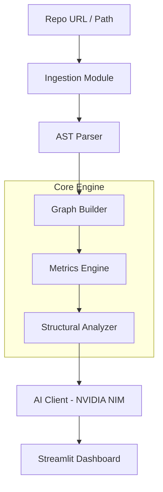

# 🔍 Vishleshana (विश्लेषण)
> **Vishleshana (विश्लेषण)** — The Sanskrit word for Analysis.

**Graph-Aware AI Codebase Analysis**

Vishleshana is a powerful static analysis tool that uses Graph Theory and NVIDIA NIM (LLMs) to help developers understand, navigate, and audit complex Python codebases instantly.

---

## ✨ Features

- **🕸️ Interactive Dependency Mapping**: Visualize how your modules interact with a dynamic, color-coded graph.
- **🧠 AI Mentorship**: Get high-level summaries and a recommended "Reading Order" for any repo.
- **📊 Complexity Triage**: Automatically identify "Danger Zones" using Cyclomatic Complexity metrics.
- **🚀 Entry Point Detection**: Find out exactly where a project starts without digging through `__init__.py` files.
- **🤖 Semantic Q&A**: Chat with your code! Ask questions like *"Where is the auth logic?"* or *"How do I add a new API route?"*.

---

## 🏗️ Architecture



---

## 🛠️ Tech Stack

- **Frontend**: Streamlit
- **Graphing**: NetworkX, Pyvis
- **AI**: OpenAI SDK, NVIDIA NIM (Llama-3)
- **Metrics**: Radon (Cyclomatic Complexity)
- **Parsing**: Python AST, Pyan3
- **DevOps**: Docker, GitHub Actions

---

## 🚀 Getting Started

### Prerequisites
- Python 3.11+
- [NVIDIA NIM API Key](https://build.nvidia.com/)

### 1. Local Installation
```bash
# Clone this repository
git clone https://github.com/Hemanth0411/vishleshana.git
cd vishleshana

# Install dependencies
pip install -r requirements.txt

# Set up environment
cp .env.example .env
# Edit .env and add your NIM_API_KEY
```

### 2. Run the Dashboard
```bash
streamlit run main.py
```

---

## 🧪 Documentation
Detailed logic and implementation details can be found in the [docs/](docs/) folder:
- [Ingestion Logic](docs/ingestion_logic.md)
- [Graph Construction](docs/graph_logic.md)
- [Structural Analysis](docs/structural_analysis.md)
- [Infrastructure & CI/CD](docs/infrastructure.md)

---

## 👤 Author
**Hemanth Reddy Annem**
- LinkedIn: [hemanth-reddy-annem](https://www.linkedin.com/in/hemanth-reddy-annem/)
- GitHub: [@Hemanth0411](https://github.com/Hemanth0411)

---
*Created with ❤️ for Advanced Code Analysis*
